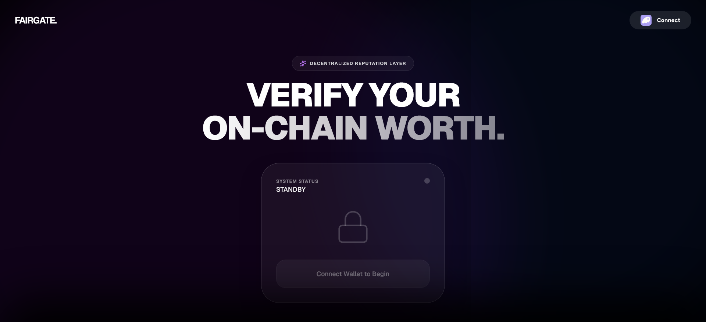

# FairGate | Decentralized Reputation Vault

**FairGate** is a next-generation access control protocol built on Solana. It leverages the **FairScale Reputation Layer** to gate access to high-value DeFi ecosystems, ensuring only trusted actors can participate in exclusive mints, governance, and yield protocols.

> **Live Demo:** [[Live Link](https://fairgate.vercel.app/)]  
> **Video Walkthrough:** [[Video Link](https://youtu.be/cOtQBZmiytQ)]



---

## 🎯 The Mission

In the current Solana ecosystem, Sybil attacks and botting degrade the experience for genuine users. **FairGate** solves this by implementing **Reputation-Gated Architecture**.

We integrated FairScale to prove three core use cases:

1.  **Gated Access:** Blocking wallets with low trust scores from accessing the Vault.
2.  **Dynamic Rewards:** Unlocking "Protocol Revenue Share" only for Legendary Tier users.
3.  **Risk Guardrails:** Automatically adjusting borrow limits (Collateral Ratio) based on wallet history.

---

## 🏗️ Architecture Overview

The application is built as a high-fidelity **Next.js 14** dApp using **Framer Motion** for hardware-accelerated animations.

### The Logic Flow:

1.  **Identity Layer:**
    - User connects via **Solana Wallet Adapter** (Phantom/Solflare).
    - The app establishes a secure handshake.
2.  **Reputation Oracle (FairScale Integration):**
    - The frontend sends the wallet address to our secure API Route (`/api/score`).
    - The API proxies the request to `api.fairscale.xyz` using a protected API Key.
    - FairScale returns the `FairScore`, `Tier` (Bronze/Silver/Gold), and `Badges`.
3.  **The Gatekeeper Engine:**
    - **IF Score < 700:** The Vault locks down. Visual feedback (Red Shield) denies entry.
    - **IF Score > 700:** The Vault unlocks. The `HeroVault` component triggers the "Grant Access" animation.
4.  **The Citadel (VIP Dashboard):**
    - Upon entry, the user accesses the **"Citadel Interface"**.
    - Real-time counters show accumulating Yield (Rewards).
    - Risk parameters (Borrow Limits) are visually relaxed to "Unlimited".

---

## 🚀 Installation & Setup

1.  **Clone the repository:**

    ```bash
    git clone (https://github.com/Mdabdullah3/fairgate.git)
    ```

2.  **Install dependencies:**

    ```bash
    npm install
    # or
    yarn install
    ```

3.  **Run the development server:**

    ```bash
    npm run dev
    ```

4.  **View the app:**
    Open [http://localhost:3000](http://localhost:3000) in your browser

### 🛡️ FairScale Integration Logic

- **Biometric Scan:** An immersive Framer Motion animation that visualizes FairScale API latency as a "Live Identity Scan."
- **Trust Tiers:** Dynamic UI states mapped directly to the `fairscore`:
  - 🔴 **Red (Risk):** Restricted access, warnings for low-reputation wallets.
  - 🟢 **Green (VIP):** Full access unlocked for high-score users.
- **Sybil Resistance:** Hard-coded logic that disables and locks the "Mint Button" for wallets identified as potential Sybil attackers or low-score entities.
- **Dynamic Yield:** A simulated high-APY reward stream that scales or unlocks exclusively for high-reputation wallets, encouraging long-term ecosystem health.

## 🛠️ Tech Stack

- **Framework:** [Next.js 16](https://nextjs.org/) (App Router)
- **Styling:** [Tailwind CSS](https://tailwindcss.com/) with Custom Glassmorphism effects.
- **Animation:** [Framer Motion](https://www.framer.com/motion/) (Complex physics-based transitions and "scanning" effects).
- **Blockchain:** [@solana/wallet-adapter](https://github.com/anza-xyz/wallet-adapter) for seamless wallet connection.
- **Data:** [FairScale API v1](https://docs.fairscale.com) for real-time reputation scoring.

## Built for the Superteam FairScale Bounty.
